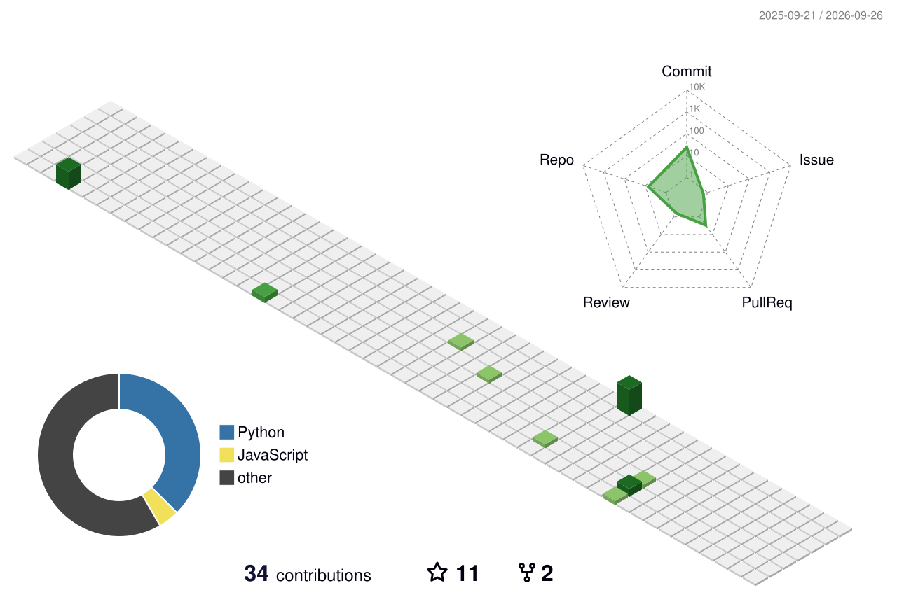

  PROFILE README · 高美学背景 × AI 系统工程 × 产品化交付

  

  

  <a href="https://www.sundershifter.com">Website</a> ·
  <a href="https://forge.sundershifter.com">Pixel Forge</a> ·
  <a href="mailto:1256206460@qq.com">1256206460@qq.com</a> ·
  <a href="https://www.liblib.art/userpage/0ae0c099e0e34a8fadce71e3aba1f531/publish">Liblib Models</a>

---

## 中文 / Chinese

我是 **TokinoChanshi**，一个把 **AI 创作、审美判断、工作流工程与产品系统** 放在同一条链路里构建的人。

我的背景来自 **环境设计**：空间、结构、光影、材质、叙事动线，这些训练让我更习惯用“系统”而不是“单点技巧”理解创作。现在我主要在做：

- **AI 图像 / 视频工作流**：把视觉风格、光影质感与生成过程沉淀成可复现流程；
- **多模态 API 与中转系统**：把模型能力封装成可接入、可运营、可迭代的软件接口；
- **媒体分发与图库系统**：围绕图片、视频、对象存储、Cloudflare 与管理后台做完整交付链；
- **Web 产品工程**：从前台体验、后台管理、部署、域名、缓存到上线闭环。

> 我不只是使用 AI 工具，而是尝试把工具变成系统。  
> I don't just use AI tools — I turn tools into systems.

### 核心信号

| 指标 | 说明 |
|---|---|
| **73+** | 已交付 LoRA / Checkpoint 模型 |
| **907K+** | Liblib 等平台真实使用 / 下载数据 |
| **AI Image / Video** | 图像、视频、工作流与生成链路 |
| **API / Infra / Product** | 中转服务、媒体分发、对象存储、前后台产品工程 |

---

## English

I'm **TokinoChanshi** — building at the intersection of **aesthetic systems**, **multimodal AI infrastructure**, and **product engineering**.

My background in **environmental design** shaped how I think: space, structure, lighting, material, and narrative flow are not just visual concepts — they are systems. I now translate that thinking into AI-native software:

- **Image / video generation workflows** with controllable aesthetic direction;
- **Multimodal API bridges** that turn model capability into usable product interfaces;
- **Media delivery systems** based on object storage, Cloudflare, galleries, and admin tooling;
- **Web products** with real deployment, routing, caching, operations, and launch readiness.

My goal is simple:

> make AI creation controllable, reproducible, scalable, and usable.

---

## Selected Work / 代表项目

### [G-Rec](https://github.com/TokinoChanshi/G-Rec)
Agentic coding system focused on structured workflows, persistent engineering context, and codebase understanding at system scale.  
面向工程上下文、长期记忆与自动化调试循环的 AI resident engineer 系统。

### [GPT-image-api](https://github.com/TokinoChanshi/GPT-image-api)
A lightweight multimodal image API bridge that converts advanced visual capability into GPT-compatible product interfaces.  
将视觉理解、多图对话与图像能力封装成可调用的 API 桥接层。

### [scope-image-orchestrator](https://github.com/TokinoChanshi/scope-image-orchestrator)
Structured image generation orchestration: prompt decomposition, provider routing, visual audit, and repair loops.  
面向复杂图像生成任务的结构化编排、审计与修复系统。

### [Liblib Model Profile](https://www.liblib.art/userpage/0ae0c099e0e34a8fadce71e3aba1f531/publish)
73+ delivered LoRA / Checkpoint models with 907K+ verified usage and downloads.  
模型训练、审美微调与可复现工作流的真实平台数据沉淀。

---

## Aesthetic × Systems × Product

| Dimension | English | 中文 |
|---|---|---|
| **Aesthetic** | lighting, atmosphere, composition, texture | 光影、氛围、构图、材质 |
| **Systems** | SOPs, orchestration, reproducibility | 流程、编排、可复现 |
| **Product** | UX, admin flow, delivery, launch | 前台体验、后台管理、交付上线 |

---

## Stack / 技术栈

**Frontend**  
Next.js · React · TypeScript · Tailwind CSS

**Backend / Infra**  
Node.js · Python · FastAPI · Docker · Nginx · Cloudflare · OCI Object Storage

**AI / Workflow**  
ComfyUI · LoRA / Checkpoint Training · OpenAI-compatible APIs · Image Workflow · Video Pipeline · Automation

---

## Motion Layer / 动态层

  <picture>
    <source media="(prefers-color-scheme: dark)" srcset="dist/github-snake-dark.svg" />
    <source media="(prefers-color-scheme: light)" srcset="dist/github-snake.svg" />
    
  </picture>

  

---

## Contact / 联系方式

- Website: https://www.sundershifter.com
- Product: https://forge.sundershifter.com
- Email: **1256206460@qq.com**
- GitHub: https://github.com/TokinoChanshi
- Liblib: https://www.liblib.art/userpage/0ae0c099e0e34a8fadce71e3aba1f531/publish

  

